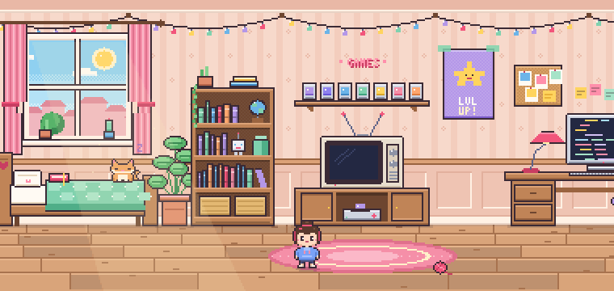
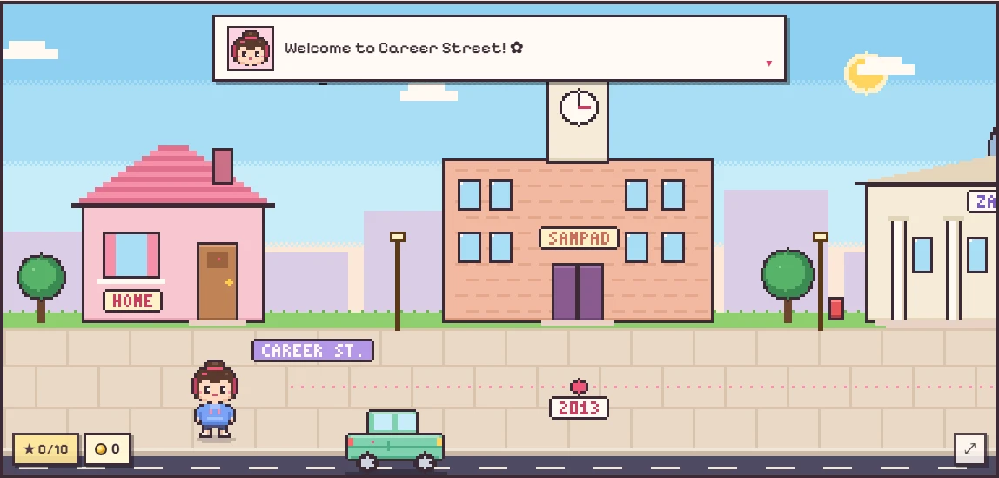
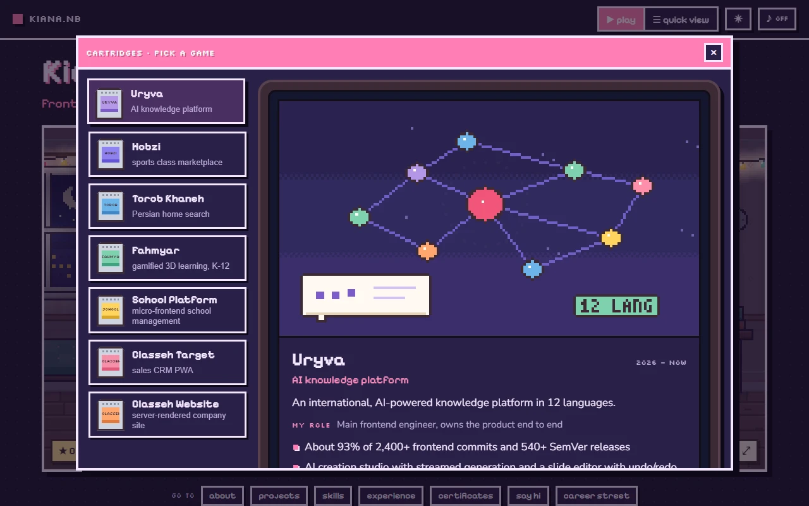
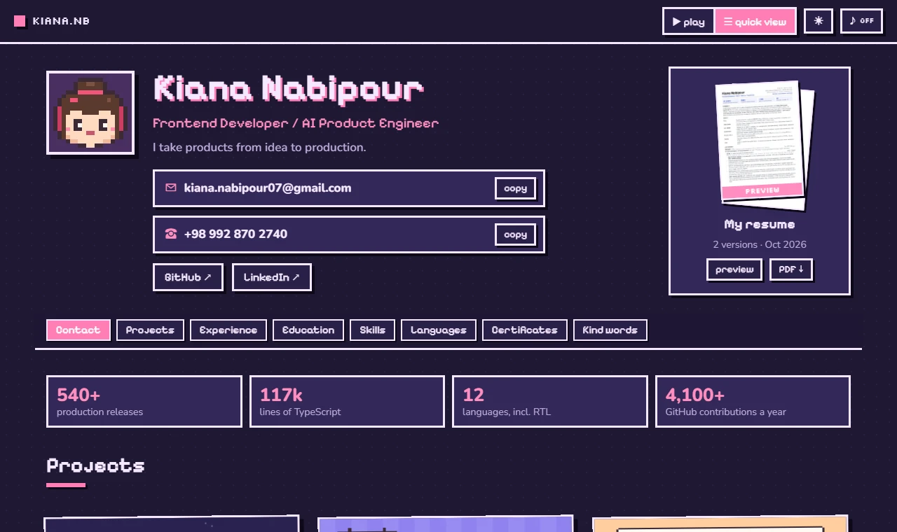
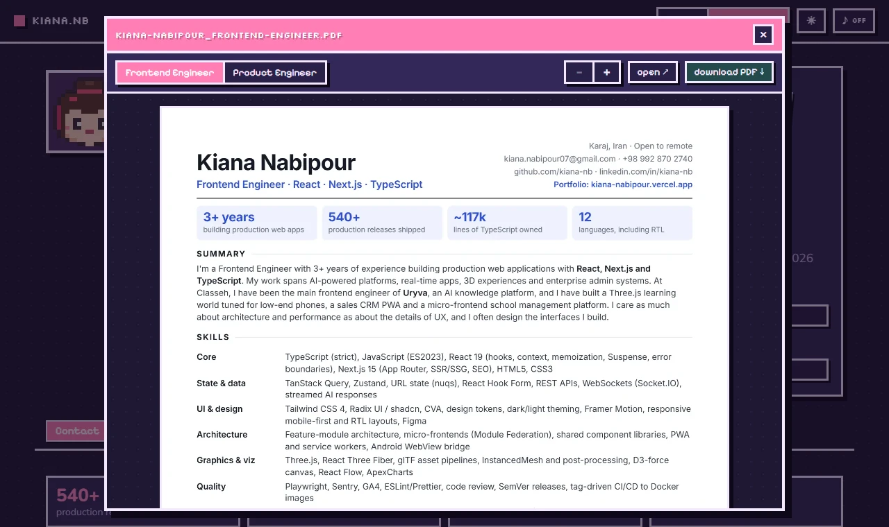

<p align="center">
  
</p>

<h1 align="center">Kiana's Pixel Room</h1>

<p align="center">
  <b>My portfolio as a tiny indie game.</b><br>
  Walk around a pixel-art room, boot my projects on an old CRT, and take a stroll down Career Street.
</p>

<p align="center">
  <a href="https://kiana-nabipour.vercel.app"></a>
</p>

<p align="center">
  <b><a href="https://kiana-nabipour.vercel.app">Play</a></b> ·
  <a href="https://kiana-nabipour.vercel.app/#quick">Quick view (no game)</a> ·
  <a href="https://kiana-nabipour.vercel.app/resume/Kiana-Nabipour_Frontend-Engineer.pdf">Resume (PDF)</a> ·
  <a href="https://www.linkedin.com/in/kiana-nb">LinkedIn</a>
</p>

<p align="center">
  <a href="https://kiana-nabipour.vercel.app"></a>
</p>

<p align="center">
  
  
  
  
</p>

---

Everything in the room is something you can poke. The journal is my about page, the bookshelf holds my skills, each project is a cartridge that boots on the CRT, and the mailbox by the door has my contact details and my resume. In a hurry? The **quick view** is the same content as a plain, readable page.

## Take a tour

<table>
  <tr>
    <td width="50%"></td>
    <td width="50%"></td>
  </tr>
  <tr>
    <td><b>Career Street</b> is outside the door: school, university, then each job, with the years painted on the sidewalk. There's a car to drive.</td>
    <td><b>Project cartridges</b> boot on the CRT. Each project has its own animated pixel cover, drawn in code.</td>
  </tr>
  <tr>
    <td></td>
    <td></td>
  </tr>
  <tr>
    <td><b>Quick view</b> for recruiters: projects, experience, skills, certificates and recommendations on one page.</td>
    <td><b>Resume preview</b>, from the mailbox or the quick view: two versions (Frontend and Product Engineer), every page, and a PDF download.</td>
  </tr>
</table>

## What's in the room

| Thing | Opens |
| --- | --- |
| Journal on the bed | About me |
| Bookshelf | Skills |
| Cartridges + CRT | Projects |
| Desk and monitor | Experience |
| Frames on the wall | Certificates |
| Mailbox by the door | Contact and my resume (preview + PDF) |
| The door | Career Street outside |
| Window | Day / night |
| Record player | A small chiptune |
| Flower pot at the far end | Water it until it blooms |
| Bowl by the certificates | Feed the cat |
| Yarn ball on the rug | Play fetch with the cat |
| The cat | Pet it and it follows you around |

Off the main path there's a softer side, kept out of the way on purpose because this is a work portfolio:

- **Coins:** every secret pays 10, and Fish Catch at the arcade (end of Career Street) pays 1 coin per 3 points as you play.
- **Dressing nook** (far end of the room, 20 coins): a wardrobe with outfits, hair colours and extras for Kiana, and things for the cat.
- **Weekend Lane** (past the arcade, 30 coins): a cinema with an animated pixel poster for each favourite series and anime, a gallery, the sports centre with a scene per sport, and a book & webtoon café.
- **Kind words:** recommendations from LinkedIn, on the cork board above the desk.
- **A nap:** the pillow on the bed leads to a short dream.

There are also ten secrets hidden in the room. The star counter in the corner keeps track and gives hints.

**Controls:** `←` `→` or `A` `D` to walk, `Space` to jump, `E` to interact, `F` for full screen, or click / tap anywhere (tap Kiana to jump). The buttons under the room walk you straight to each part.

## How it's built

- **Vite + React 19 + TypeScript**, no game engine.
- The room is drawn in code on a low-resolution canvas (`src/game`), scaled up with `image-rendering: pixelated`. Big furniture is drawn from primitives, characters are string sprites, and night mode is a lighting pass with cut-out light sources.
- Each project has its own animated pixel cover (`src/game/covers.ts`).
- Sound uses WebAudio and only starts after you turn it on.
- The resume preview shows pre-rendered page images (`scripts/resume-pages.mjs` renders them from the PDFs with pdf.js), because PDFs don't display inline on most phones. The PDF stays the download.
- Respects `prefers-reduced-motion` and the light / dark color scheme.

## Run it

```bash
npm install
npm run dev
```

`npm run build` makes a normal static build in `dist/`. `npm run build:artifact` inlines everything (JS, CSS, fonts) into a single HTML file in `dist-artifact/`.

### Updating the resume

Replace the PDFs in `public/resume/`, then run `node scripts/resume-pages.mjs` to re-render the preview images in `src/assets/resume/`. It needs Playwright (local or global) and network access for pdf.js.

### Adding photos and paintings

Drop image files into `src/artworks/photos` and `src/artworks/paintings`. They appear in the gallery in file-name order, and the file name becomes the caption. Clicking a piece opens it full size; arrow keys or a swipe move through the set. Keep each image around 1200px wide and under 300 KB.

## Content

Every project claim in `src/content.ts` comes from my own git history. Please don't add numbers or skills there without checking them.
